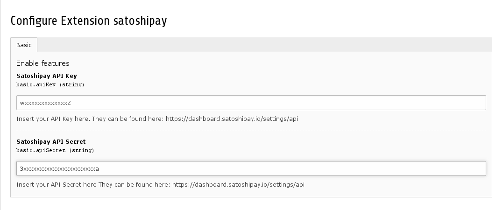

.. ==================================================
.. FOR YOUR INFORMATION
.. --------------------------------------------------
.. -*- coding: utf-8 -*- with BOM.

.. include:: ../Includes.txt

.. _admin-manual:

Administrator Manual
====================

.. _admin-installation:

Installation
------------

To use this extension API Access to SatoshiPay is required. You will need the API Key and Secret.

You can create an account on their website at https://dashboard.satoshipay.io/sign-up 

Installing from TER or GitHub
^^^^^^^^^^

You can either install this extension from the `TYPO3 Extension Repository <https://typo3.org/extensions/repository/view/satoshipay>`_ or from the `GitHub repository <https://github.com/zechendorf/satoshipay>`_.

Setting the API Key and Secret
^^^^^^^^^^

After installing the extension you need to set your API Key and Secret. This can be done by clicking the gears Icon in the Extension Manager.

Adding the TypoScript Template
^^^^^^^^^^

Finally you will need to add the static TypoScript template (SatoshiPay) to your website's template.

.. _admin-faq:

FAQ
---

...if there are questions - do not hesitate to ask. I will gladly add frequently asked question to this page.
