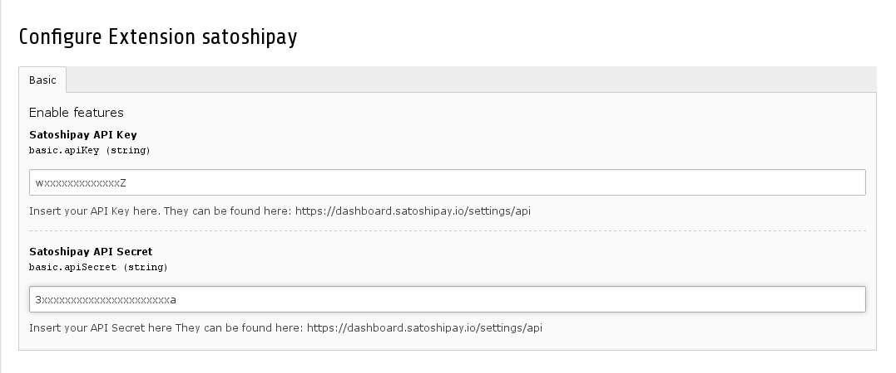

.. ==================================================
.. FOR YOUR INFORMATION
.. --------------------------------------------------
.. -*- coding: utf-8 -*- with BOM.

.. include:: ../Includes.txt

.. _configuration:

Configuration Reference
=======================

Right now you will only need to configure your SatoshiPay credentials in the Extension configuration at the extension manager.

.. _configuration-faq:

FAQ
---

Nothing yet.
