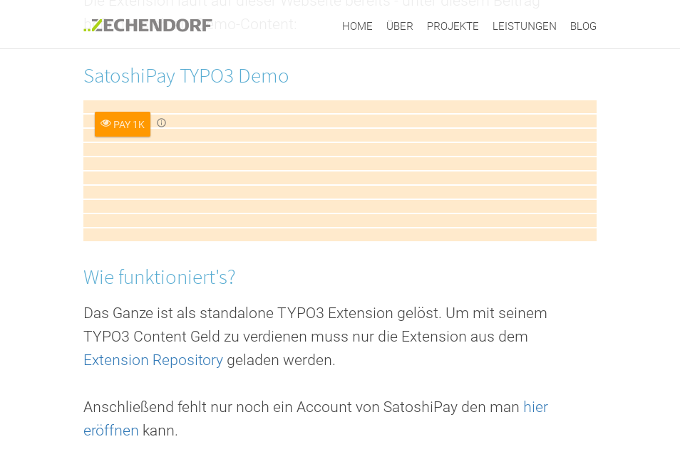
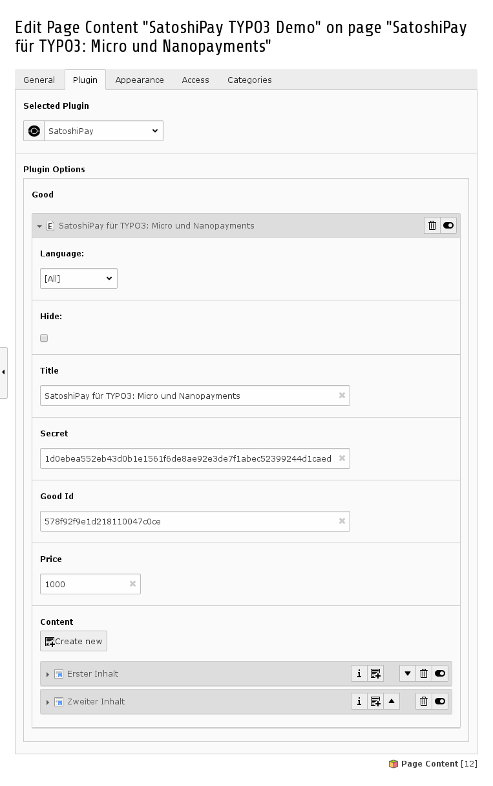

.. ==================================================
.. FOR YOUR INFORMATION
.. --------------------------------------------------
.. -*- coding: utf-8 -*- with BOM.

.. include:: ../Includes.txt

.. _introduction:

Introduction
============

.. _what-it-does:

What does it do?
----------------

This extension allows to create paywalled content. The paywall is provided by SatoshiPay.

.. important::

   To run this extension an account with SatoshiPay is needed it can be created here: https://dashboard.satoshipay.io/sign-up

After installation and configuration of this extension the user will be able to create SatoshiPay-Content (via Plugin) where they can add multiple content elements to a paid-content object (see screenshots).

.. _screenshots:

Screenshots
-----------

This chapter should help people figure how the extension works. Remove it
if not relevant.

   This is how it will look in the frontend

   This is how the plugin looks in the backend
