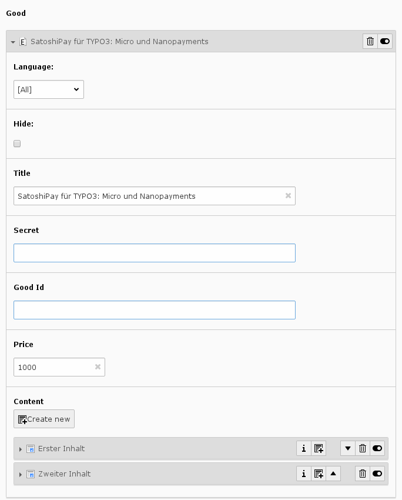

.. ==================================================
.. FOR YOUR INFORMATION
.. --------------------------------------------------
.. -*- coding: utf-8 -*- with BOM.

.. include:: ../Includes.txt

.. _user-manual:

Users Manual
============

To create paywalled content create a new content-element of type "Satoshipay" on the page where the content should be displayed.

.. figure:: ../Images/UserManual/UserContentElement.png
   :width: 500px
   :alt: content element

   content element in web/page view

In the "plugin" tab you can create a new good

.. figure:: ../Images/UserManual/UserCreateGood.png
   :width: 500px
   :alt: create good

   Create a new good
   
After that, define a title and a price and add some content elements

   Edit a good

.. important::

   Since you do not want your content shown you will have to set the column attribute of each element to a column that will not be shown in the frontend. If you are confused by this: Ask your TYPO3 administrator - or me.

.. _user-faq:

FAQ
---

...if there are questions - do not hesitate to ask. I will gladly add frequently asked question to this page.
