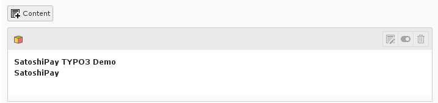
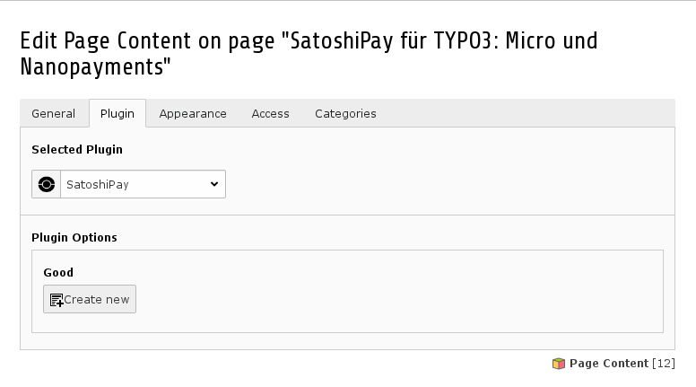
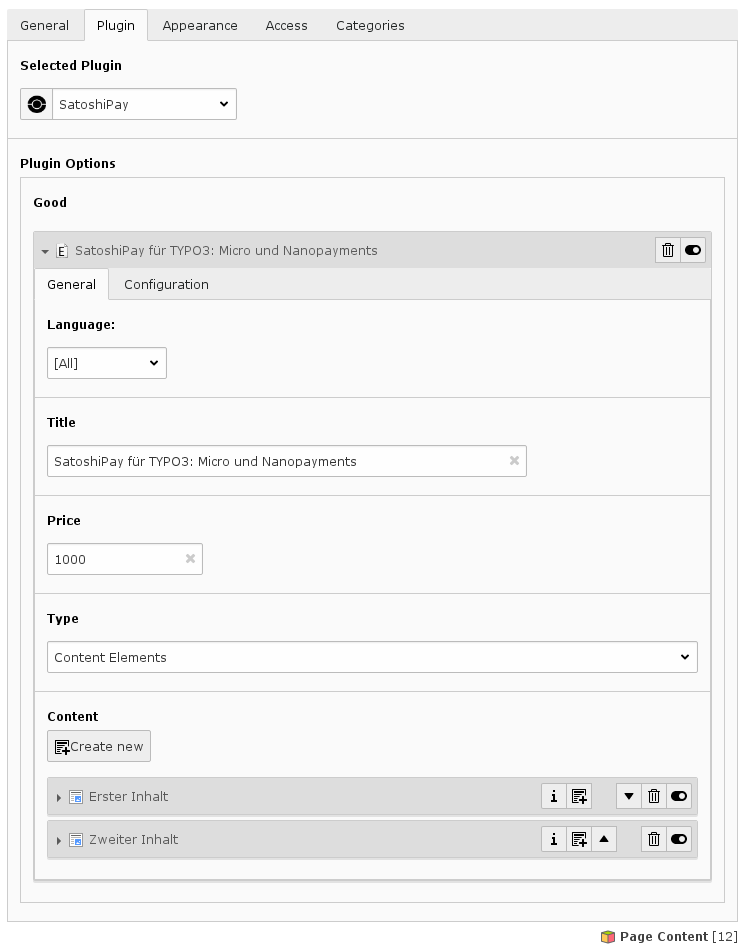
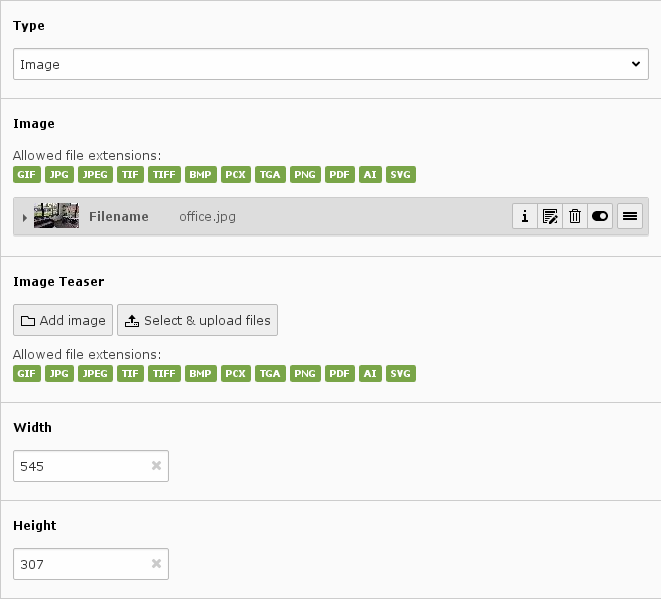
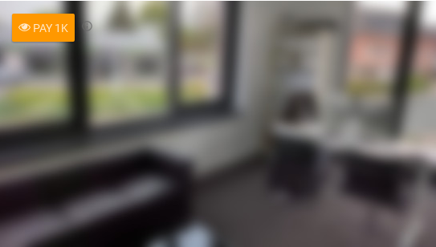
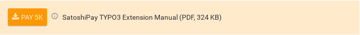

.. ==================================================
.. FOR YOUR INFORMATION
.. --------------------------------------------------
.. -*- coding: utf-8 -*- with BOM.

.. include:: ../Includes.txt

.. _user-manual:

Users Manual
============

To create paywalled content create a new content-element of type "Satoshipay" on the page where the content should be displayed.

   content element in web/page view

In the "plugin" tab you can create a new good

   Create a new good
   
After that, define a title and a price and the Type (currently supported: content, image or download).

Type: Content
^^^^^^^^^^^^^^^^^

This is the default type. It allows you to create as many content elements as you like.

   Edit a good with content elements

.. important::

   Since you do not want your content shown you will have to set the column attribute of each element to a column that will not be shown in the frontend. If you are confused by this: Ask your TYPO3 administrator - or me.

Type: Image
^^^^^^^^^^^^^^^^^

This is a type supported by SatoshiPay as of July 22nd 2016. It allows you display a single image. In This mode you can define the width and height of the container, define an Image and an (optional) teaser image.

   Edit an image good
   
This is how it will be shown in the frontend:

Type: File (Download)
^^^^^^^^^^^^^^^^^

This is a type supported by SatoshiPay as of July 22nd 2016. It allows you paywall a file download (PDF for example).
   
This is how it will be shown in the frontend:

Tab Configuration
^^^^^^^^^^^^^^^^^

The Configuration Tab stores SatoshiPay information. Unless you know exactly what you are doing you don't need to change anything here.

.. warning::

   Do not set the "Good Id" in tab "Configuration" unless you know exactly what you're doing. It will be set automatically after initializing the good with SatoshiPay.

.. _user-faq:

FAQ
---

...if there are questions - do not hesitate to ask. I will gladly add frequently asked question to this page.
